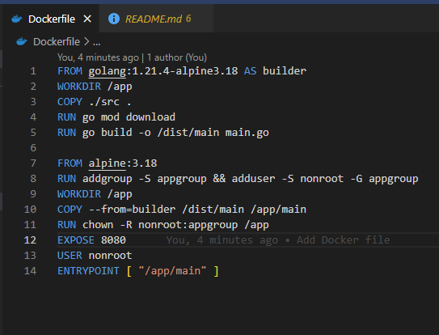
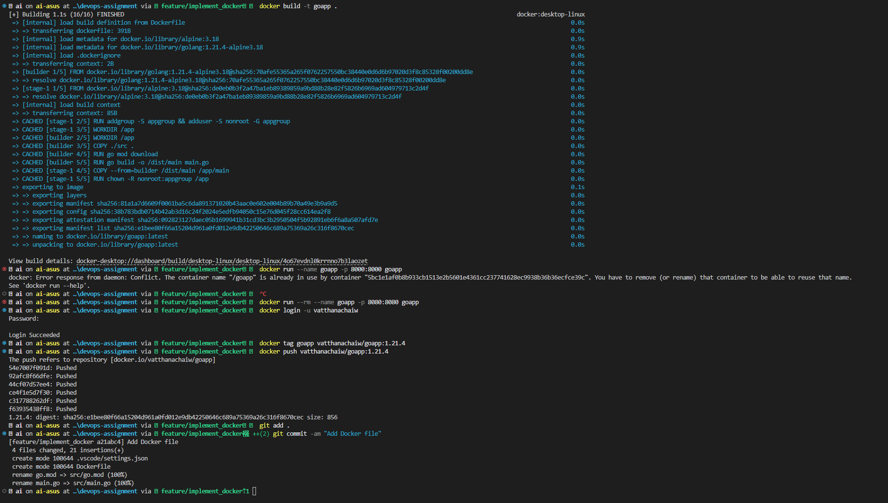
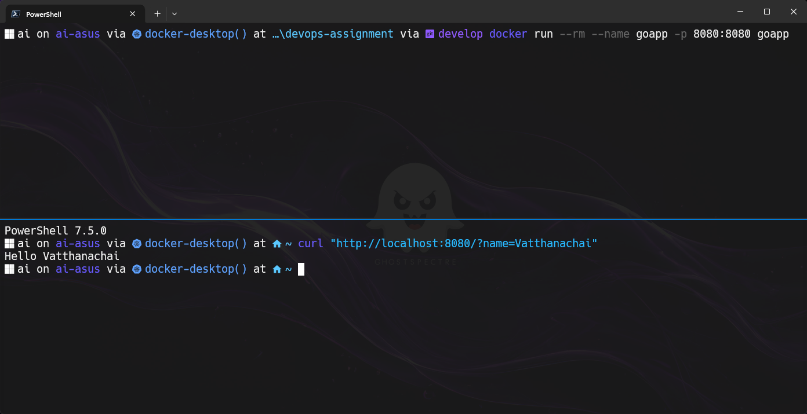
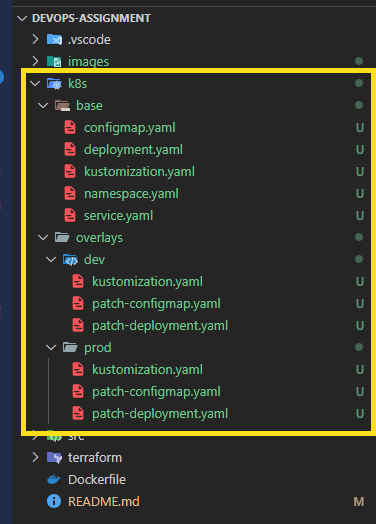
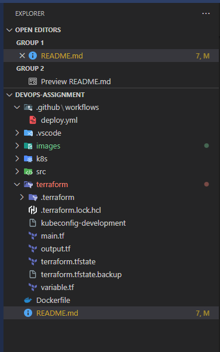
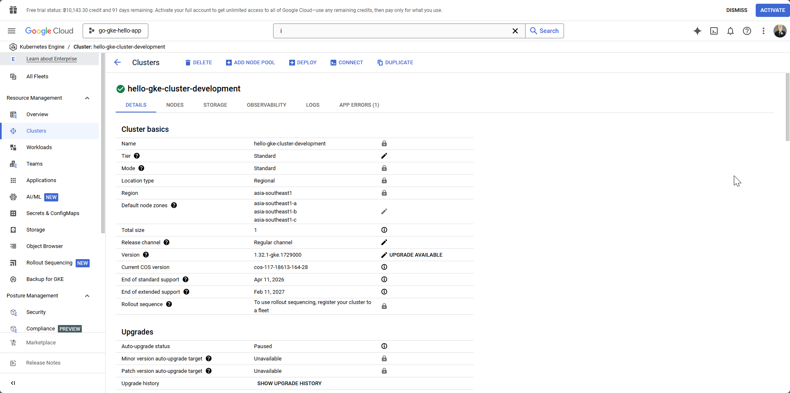
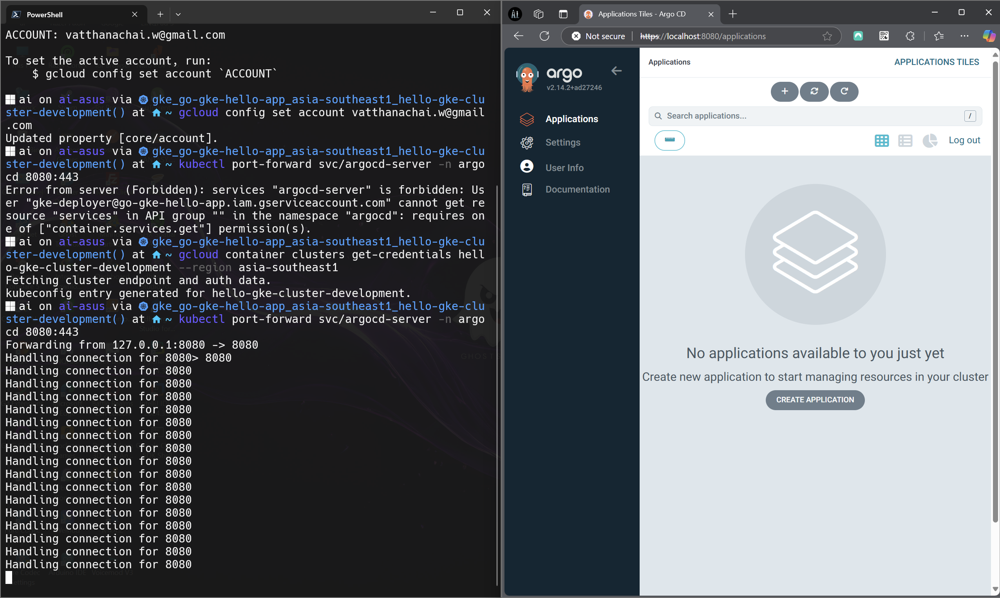
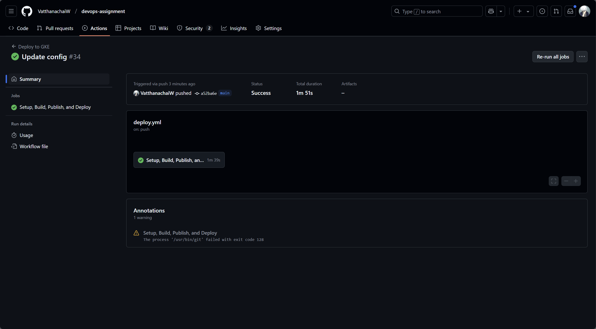

**Candidate Assignment Instructions:**

The sample application is developed using Go. Our development team would like to deliver this application to Production. As a DevOps engineer, you are responsible to complete the tasks by following these key areas: High Availability, Scalability, Security.

**Task:**

1. Create a Dockerfile for a given application

**Expected Output:** Dockerfile

**Result**

2. Build the image using the Dockerfile and push to Docker Hub

**Expected Output:** Build and push command and Docker Hub url

**Result**
Docker command for build, tag and push
Docker image Uri: https://hub.docker.com/r/vatthanachaiw/goapp

3. Create a Kustomize manifest to deploy the image from the previous step. The Kustomize should have flexibility to allow Developer to adjust values without having to rebuild the Kustomize frequently

**Expected Output:** Kustomize manifest file to deploy the application

**Result**

4. Setup GKE cluster with the related resources to run GKE like VPC, Subnets, etc. by following GKE Best Practices using any IaC tools (Terraform, OpenTufo, Pulumi) (Bonus point: use Terraform/Terragrunt)

**Expected Output:** IaC code

**Result**

* Condition: Avoid injecting the generated GCP access keys to the application directly. **Expected Output:** Kustomize manifest, IaC code or anything to complete this task.

6. Use ArgoCD to deploy this application. To follow GitOps practices, we prefer to have an ArgoCD application defined declaratively in a YAML file if possible.

**Expected output:** Yaml files and instruction how to deploy the application or command line

**Result**
!Not complete

7. Create CICD workflow using GitOps pipeline to build and deploy application **Expected output:** GitOps pipeline (Github, Gitlab, Bitbucket, Jenkins) workflow or diagram

**Result**
!Not Complete Authorization failed
